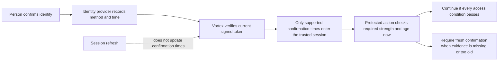

# Verified recent authentication

[Identity](../02-people-organisations-and-sign-in.md#recent-authentication-evidence) · [Access](../04-access-and-permissions.md#where-access-is-enforced) · [Groups and privileged activation](groups-and-privileged-access.md) · [Delivery #276](https://github.com/Abzum-NZ/Abzum-Vortex/issues/276)

## User-visible rule

A protected action may require a recent sign-in or a recent multi-factor confirmation. Remaining signed in, refreshing a session or opening another page does not count as a new confirmation. Ordinary actions remain available to an otherwise valid session when that evidence is absent. The action's access policy determines the required strength and maximum age; Identity does not impose a universal duration or require MFA for every action.

For privileged role activation, check this requirement when activation actually happens, after any approval wait. Approval cannot keep an earlier authentication fresh indefinitely. An eligible role or a recorded approval does not itself grant active access.

## Minimum evidence and ownership

The verified Identity result and safe server session may carry `primaryAuthenticatedAt` and `multiFactorAuthenticatedAt`. Each is independently optional. They are derived from the current verified provider session, not supplied by a browser or copied from an ordinary record. No raw token, authentication-method list, provider identity details or new authentication-history table is introduced.

The human organisation context copies those exact derived times. Only when at least one is present does it also carry the already-verified `accessTokenIssuedAt` needed to check their upper bound. Evidence-bearing contexts require that token-time field; ordinary evidence-free contexts retain their existing shape. Existing identity, session, organisation-account and expiry binding remains authoritative. Federated, system and public context forms do not gain these fields through this change.

Identity owns provider interpretation; the [single access decision #34](https://github.com/Abzum-NZ/Abzum-Vortex/issues/34) owns whether the evidence meets an action's policy. The legacy `recent_multi_factor` strength label is compatibility data, never a confirmation timestamp or proof of recency. Neither a label nor context creation time can manufacture missing evidence.

The final human context rejects a multi-factor confirmation timestamp paired with `single_factor` strength, matching the verified Identity and session boundaries. A legacy `recent_multi_factor` context may coexist with genuine validated MFA evidence for compatibility, but the label supplies none; the current Identity producer emits `multi_factor`, not that legacy value. TypeScript and database validation must enforce the same rule.

## Supported provider mapping

The first mapping is pinned to Supabase Auth `v2.196.0`, selected by the repository's Supabase CLI `2.116.0`. Review the [pinned provider method evidence](https://github.com/supabase/auth/blob/v2.196.0/internal/models/amr.go) and [official claim reference](https://supabase.com/docs/guides/auth/jwt-fields) when changing that dependency; an unfamiliar provider method does not acquire privileged meaning automatically.

| Verified method                                            | Confirmation supplied          | Required provider strength                  |
| ---------------------------------------------------------- | ------------------------------ | ------------------------------------------- |
| `password`, `magiclink`                                    | Primary sign-in time           | `aal1` or `aal2`                            |
| `totp`, `mfa/phone`, `mfa/webauthn`                        | Multi-factor confirmation time | `aal2`                                      |
| `otp`, other methods, or legacy string-only method entries | None                           | Ordinary session verification still applies |

The pinned provider's [implicit verification paths](https://github.com/supabase/auth/blob/v2.196.0/internal/api/verify.go) emit `otp` for multiple purposes, including recovery, invitation and email change. That method alone therefore cannot prove the qualifying primary sign-in required here, even at `aal1`. The explicit [magic-link flow](https://github.com/supabase/auth/blob/v2.196.0/internal/api/magic_link.go) preserves its own method, separately from [recovery](https://github.com/supabase/auth/blob/v2.196.0/internal/api/recover.go). Later MFA does not erase a valid password or magic-link confirmation. The initial mapping also does not infer qualifying primary confirmation from OAuth, SSO, account creation or token refresh. Supporting additional ceremonies requires verified provider semantics and tests, not a spelling match. A real user may therefore need a supported fresh confirmation for a protected action while retaining normal access.

For each confirmation class, use the newest qualifying timestamp regardless of provider list order. A timestamp qualifies only if it is no later than the token's issue time and the verifier's current clock. Unsupported, future or strength-inconsistent entries supply no confirmation time. Existing malformed-claim refusal remains strict; this is not permission to accept malformed required identity claims. A documented SSO provider detail may be accepted at the raw provider boundary but is discarded and never becomes Vortex authority.

## Time and compatibility checks

Authentication evidence has no forward clock allowance and is never clamped to the present. Existing token verification retains its maximum 60-second clock difference; this tolerance does not turn a future authentication timestamp into valid evidence. A token issued slightly ahead of the verifier clock can still be an ordinary valid session, or carry an independently valid confirmation that occurred no later than now.

The human context requires each confirmation time to be no later than `accessTokenIssuedAt`. That token time must precede the context expiry and be no more than 60 seconds ahead of context creation. The database independently rejects confirmation times later than its current statement time. These structural checks do not replace current session, account, Access-version or action-policy checks. Request-context/session expiry retains its existing zero-skew boundary.

## Delivery evidence

[#276](https://github.com/Abzum-NZ/Abzum-Vortex/issues/276) must prove the complete verifier-to-session-to-human-context path, including old confirmation after token refresh, absent evidence, supported and unsupported methods, provider ordering, contradictory strength, malformed inputs, future evidence, the token-skew boundary and refusal of browser or cross-caller injection. The strict database context validator changes through an additive migration, with request-role regression proof and no reset of an existing database.

These are the implementation requirements, not a claim that #276 or user-facing PIM is complete. [#33](https://github.com/Abzum-NZ/Abzum-Vortex/issues/33), [#34](https://github.com/Abzum-NZ/Abzum-Vortex/issues/34) and [#40](https://github.com/Abzum-NZ/Abzum-Vortex/issues/40) own protected role facts and enforcement; [IAM #267](https://github.com/Abzum-NZ/Abzum-Vortex/issues/267) owns the later activation and conditional approval journey. Held [#30](https://github.com/Abzum-NZ/Abzum-Vortex/issues/30) is not started by this work.
