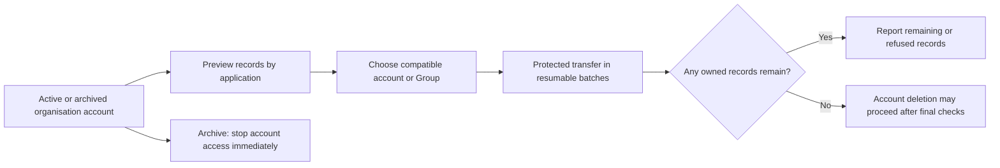
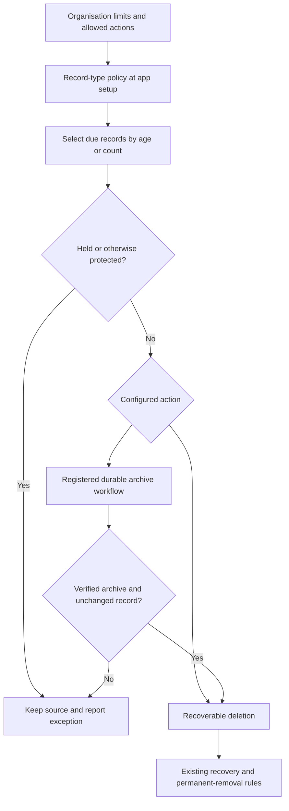

# Record ownership, offboarding and lifecycle policies

[Records](../06-records-and-lifecycle.md) · [People](../02-people-organisations-and-sign-in.md) · [Retention](../14-activity-privacy-and-retention.md)

These requirements implement the owner's 12 September 2026 decisions. They are
delivery requirements, not claims that the engines or administration pages exist.

## Initial ownership

For an account-owned record, the Access-resolved effective organisation account
performing the create is the initial owner (the creator in an ordinary request); a create form cannot nominate another account. For a Group-owned
record, the form must select an active Group in that organisation of which the
same effective account is currently a member. Keep the original initiator in
attribution when a governed specified-account flow performs the create. Missing, foreign, retired or non-member selections
are refused. Both cases also require the normal create and field permissions.
Recheck membership and account state in the create transaction. Ownership-disabled
types remain ownerless. A system actor has no fabricated human membership: a
system create uses its existing private scoped execution binding and a compatible
explicit target owner checked by the protected ownership operation. It cannot
accept a caller-supplied actor or bypass assignment authority. Human creates keep
the creator/current-membership defaults above.

The initial private storage primitive in
[#402](https://github.com/Abzum-NZ/Abzum-Vortex/issues/402) accepts only a trusted
human request context. Governed specified-account and System execution remain
with [#322](https://github.com/Abzum-NZ/Abzum-Vortex/issues/322); the primitive
does not anticipate them with caller-selected ownership or authority.

Later ownership changes use the protected named ownership action, not ordinary
field updates. The new owner must be an active organisation account or active
Group permitted by the record type's published ownership mode and the operator's
transfer authority. Transferring ownership does not grant roles or membership and
never changes creator/changer history, record identity or organisation.

## Archive a person and transfer ownership

Archiving a person means making their **organisation account inactive** through
the existing protected account operation; it is not deletion of their global
identity. Entry and account-derived authority stop under current Access rules.
Their other organisation accounts are unaffected. The account remains available
as historical attribution. Reactivation uses existing governed restoration and
does not silently revive revoked grants or privileged activations.

An authorised administrator can preview and transfer records from either an
active or archived account to another permitted account or Group, **by application**
or across all applications in the organisation. Transfer can be used independently
of offboarding. Account-only ownership types accept accounts; Group-only types
accept Groups. A requested target incompatible with any selected type is shown
as refused, not silently converted to a different ownership model.

The inventory includes active, soft-deleted and otherwise retained records owned
by the source, including disabled application installations. Organisation-shared
records appear once in a separate shared section, with every affected application
shown. Selecting one application does not copy or privately reassign its shared
records; the user explicitly includes them with their organisation-wide impact.
Group memberships and creator/audit references are not account-owned records and
are not reassigned. Inherited ownership follows its authoritative owner record;
do not create a conflicting child-owner copy.

Preview includes per-application/type counts, target compatibility, refused items
and shared impact. Execution uses bounded, retry-safe batches of the same protected
ownership action, current permissions and expected revisions. It reports completed,
conflicted and refused records and can resume; it never claims a large transfer is
one atomic transaction. Recheck scope and target state for each batch. The same protected ownership
operation has a narrowly scoped offboarding path for retained/soft-deleted rows
and disabled installations using the exact stored definition and current transfer
authority. It does not restore the row or reactivate the application. Account
deletion additionally fences new ownership assignments to the closing account,
then checks all retained scopes in the final protected operation. It refuses while
any owned record remains or inventory completeness cannot be proved, including
records hidden from the requesting administrator. Safe counts/refusals disclose no
otherwise unreadable records.

Account deletion retains the minimum non-content historical reference required by
audit/retention; it does not erase authored history or bypass privacy/legal holds.
Global identity deletion remains a separate operation across every organisation.

## Record-type lifecycle policy

Every installed record type has an explicit lifecycle policy selected by an
authorised administrator during application setup. It is not a PostgreSQL TTL
on a shared physical table. Policy scope is organisation + storage contract +
permanent application root ID for application-contained rows. Organisation-shared rows have
one organisation-owned policy referenced by all consuming applications. Ordinary
release/binding upgrades preserve policy identity, age and counts; installing
or editing another application cannot change it silently.

Organisation settings specify the maximum permitted retention days and maximum
retained-record count, and allowed end-of-life actions/archive destinations. Each
record-type policy may be stricter but not exceed those limits. Either limit may
be absent only when the organisation explicitly allows that absence; choosing
unlimited retention is an explicit setting, not a missing-policy fallback.

Age is elapsed UTC time since record creation, not since the last edit. Count
includes all retained records in that policy scope, including recoverable or held
records; permanently removed records do not count. At most N retained records are
within the count limit: excess candidates are selected oldest-created first, with
permanent record ID as the tie-breaker. If both age and count are configured,
either can make a record due. Count/age are lifecycle targets, not entitlement
quotas: blocked removal reports a visible over-limit condition rather than silently
deleting protected data or inventing a create denial.

End-of-life actions are an explicit recoverable deletion under the existing
recovery policy, or an exact registered backend durable workflow to archive to an
approved destination followed by that protected deletion. Permanent removal still
follows recovery periods, legal holds and privacy rules. There is no unrestricted
SQL, URL or provider credential in a policy. The archive workflow receives stable
record references, executes through normal Vortex permissions and Connections,
and produces verified destination evidence before any source deletion is accepted.
Failed, unavailable or incomplete archival retains the source and reports pending
or failed status; retries do not duplicate archives or delete a newer record.
Recheck record revision and current policy before deletion. A legal hold prevents
removal and cannot be bypassed by an archive workflow.

Definition validation checks declared lifecycle shape/references; protected live
policy save and application activation require a concrete
policy within current organisation limits and all capabilities that its selected
action needs. A workflow-based policy cannot be enabled before workflow registration
and the required Connection are ready. Definition-only authoring remains possible.
Lowering organisation limits or changing a policy previews affected records and
requires the normal authorised confirmation, then applies the new policy revision
in bounded batches. It never starts an unbounded deletion inside settings save.

The maximum also covers recoverable source retention; the active period plus
recovery period must fit the organisation ceiling. Legal holds are an explicit
exception, not a new unlimited policy. An archive destination must have its own
approved retention/residency/deletion handling; moving records elsewhere is not
proof of deletion or a way around organisation limits.

## Scheduled time-based calculations

A value that depends on the current time, such as whether a named deadline has
passed, is a read-time computed field ([Decision 4](../../build-plan/architecture-decisions-2026-09-25.md#decision-4--formulas-and-read-time-computed-fields)).
It is a [formula](frontend-rule-designer.md#formulas) that uses `now`, and it is
computed whenever the record is read. It is never stored, and no background
worker, due-time metadata or recalculation refreshes it. The first release's
read-time form is the deadline-passed calculation in
[05](../05-modules-fields-and-relationships.md#calculations-and-totals): it reads
the record's stored deadline and status and the explicitly listed terminal status
values, so an overdue record is correct at every read without a person editing it.
Neither a person, an agent nor a flow can submit a read-time value on save.

Detail views, list filters, sorting, grouping and query-time aggregation,
exports and MCP evaluate the same formula. A filterable or sortable read-time
field compiles to SQL inside the authorised query, so filtering, sorting and
paging run over every matching record rather than over an already-selected page.
One statement uses one statement timestamp in the organisation's time zone, which
also decides the current date for a date-only deadline, so the rows it returns
agree with each other. No read waits for, or is refused because of, pending
freshness. The value is disclosed only when the field and its inputs are readable
to the viewer, like any other calculated field. Components display the value the
engine returns and never compute it themselves. Queries that use a read-time
field bypass the data-result cache
([17](../17-runtime-storage-and-caching.md#cache-model)), because the value changes
without any data change.

Stored values never depend on a read-time field. A calculation that uses a
read-time field is itself read-time. A relationship total is stored, so
publication refuses a total whose aggregate source, aggregate-source filter or
dependency chain includes a read-time field. Calculations and totals that do not
depend on the current time remain stored and save-driven.

An overdue escalation is an ordinary flow with a `Schedule` trigger and `durable`
execution, not a stored value
([Decision 1](../../build-plan/architecture-decisions-2026-09-25.md#decision-1--one-flow-definition-one-vortex-flow-engine-kestra-for-durable-work)).
It belongs to the release of the module or application that owns it; the platform
provides no managed escalation flow. Kestra runs the schedule and is
authoritative for whether an occurrence ran. Each occurrence queries the records
whose read-time value shows them overdue and acts on them through protected
tasks that call back into Vortex, where access is rechecked before every task.
The flow runs as the specified account or System that it declares, through a
scoped [execution grant](frontend-rule-designer.md#run-as); it never borrows the
authority of the person who last saved a record. Duplicate protection is keyed by
occurrence, installation revision, flow, task path and iteration, so a retried
occurrence repeats no effect. An escalation that must happen once per record
states that in the flow, for example by filtering on a stored escalation field
that the flow sets through apply record changes; the platform keeps no hidden
per-record escalation state. An overdue record is escalated at the first scheduled
occurrence after its deadline, while the read-time value is exact at every read.

Escalation schedules follow the ordinary
[installation, upgrade and uninstallation](application-packages.md#installation)
lifecycle ([09](../09-workflows-and-pipelines.md)). Installation registers them in
Kestra as inactive and enables them only after the installation revision is
activated. An upgrade or explicit rollback enables the matching revision's
schedules and disables superseded ones, and every scheduled start rechecks that
its exact installation revision is still active. Uninstallation stops new
scheduled starts while draining and then removes the schedules with the
installation's other Kestra registrations. There is no second scheduler, no
separate Vortex recalculation engine and no deployed flow per record.
