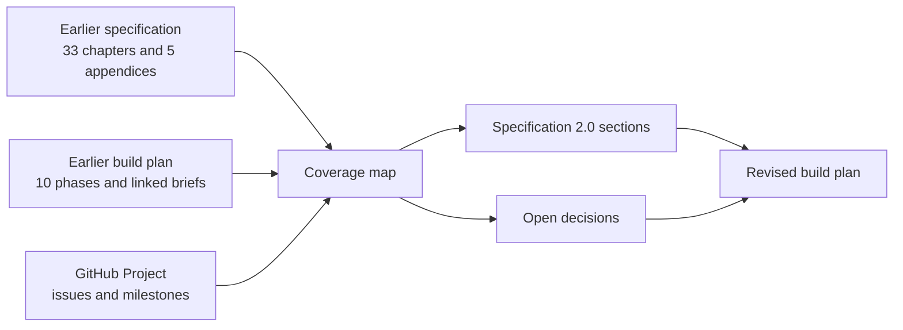

# Coverage and traceability map

[Specification index](../README.md) · [Revised build plan](../../build-plan/README.md) · [GitHub Project](https://github.com/orgs/Abzum-NZ/projects/2/views/1)

This map proves that the rewrite did not silently drop the earlier [Platform Specification](https://claude.ai/code/artifact/f202d3c7-4c73-417c-bd3f-90740c2bc1d4) or [Build Plan](https://claude.ai/code/artifact/58852ead-2acc-4ca6-a693-6cb03705bcef). “Changed” means the earlier wording was contradictory, incomplete, unsafe, or inconsistent with the repository.

## Earlier specification coverage

| Earlier chapter | New governing section | Treatment |
|---|---|---|
| 1. What Abzum Vortex is | [Purpose, scope and product boundaries](../01-purpose-and-scope.md) | Rewritten around outcomes, boundaries, and principles. |
| 2. Tenants and people | [People, organisations and sign-in](../02-people-organisations-and-sign-in.md), [Access and permissions](../04-access-and-permissions.md), [Quality and acceptance](../20-quality-and-acceptance.md) | “Tenant” removed from user language; sign-in conflict and isolation-test flaw corrected. |
| 3. Tenant Portal | [People, organisations and sign-in](../02-people-organisations-and-sign-in.md), [Applications](../07-applications-pages-and-themes.md), [Billing](../15-plans-billing-and-usage.md) | Treated as a protected platform application; detailed screen design belongs in its application definition. |
| 4. What a module is | [Modules, fields and relationships](../05-modules-fields-and-relationships.md) | Preserved and clarified. |
| 5. Fields | [Modules, fields and relationships](../05-modules-fields-and-relationships.md), [Data contracts](data-contracts.md#field-contract) | All 22 types retained; public display and application binding added. |
| 6. Relationships and deletion | [Modules, fields and relationships](../05-modules-fields-and-relationships.md#relationships), [Records](../06-records-and-lifecycle.md#deletion-and-restoration) | Required-link contradiction moved to [D07](decisions.md#d07-required-links-and-deletion). |
| 7. Actions, permissions and events | [Access](../04-access-and-permissions.md), [Forms, actions, rules and events](../08-forms-actions-rules-and-events.md) | Separated by concern. |
| 8. Extending a module | [Composition and publication](../03-composition-and-publication.md), [Modules](../05-modules-fields-and-relationships.md), [Copying and sharing](../16-copying-sharing-import-export.md) | Extension points remain declarative; customer executable code remains excluded. |
| 9. What an application is | [Applications](../07-applications-pages-and-themes.md) | Preserved with one publication root. |
| 10. Navigation and pages | [Applications](../07-applications-pages-and-themes.md) | Six page types and four list arrangements retained. |
| 11. Look and feel | [Themes](../07-applications-pages-and-themes.md#themes), [Quality](../20-quality-and-acceptance.md) | Accessibility made part of publication and acceptance. |
| 12. Permissions on the page | [Access](../04-access-and-permissions.md), [Applications](../07-applications-pages-and-themes.md) | Page visibility explicitly secondary to server enforcement. |
| 13. What happens when a record is saved | [Records](../06-records-and-lifecycle.md#save-sequence) | Transaction sequence and concurrency token made explicit. |
| 14. Rules and instant automation | [Forms, actions, rules and events](../08-forms-actions-rules-and-events.md) | Preserved; unsafe condition dropping prohibited. |
| 15. Background work | [Workflows and pipelines](../09-workflows-and-pipelines.md), [Runtime](../17-runtime-storage-and-caching.md) | Callback, duplicate protection, state authority, and dispatcher supplied. |
| 16. Guided forms and process pipelines | [Applications](../07-applications-pages-and-themes.md#forms-and-guided-forms), [Workflows and pipelines](../09-workflows-and-pipelines.md#process-pipelines) | UI and execution dependencies reconciled. |
| 17. Reading data | [Queries, reports, search and live updates](../10-queries-reports-search.md) | “Saved view” is the one term; invalid predicates fail closed. |
| 18. Search | [Queries, reports, search and live updates](../10-queries-reports-search.md#search) | Access recheck and freshness decision added. |
| 19. Files and attachments | [Files and attachments](../11-files-and-attachments.md) | Conflicting field settings unified through [D06](decisions.md#d06-attachment-type-policy). |
| 20. Connections to other systems | [Connections and programmable interfaces](../12-connections-and-interfaces.md) | OAuth lifecycle, request forgery protection, retries, redaction, and inbound replay supplied. |
| 21. Application interface and assistant | [Connections and interfaces](../12-connections-and-interfaces.md), [Assistant](../13-assistant.md) | Split into two safety boundaries; model step reconciled. |
| 22. Activity, personal data and retention | [Activity, privacy and retention](../14-activity-privacy-and-retention.md) | Data inventory, erasure scope, legal holds, backups, search, caches, workflows and assistant added. |
| 23. Billing and usage | [Plans, billing and usage limits](../15-plans-billing-and-usage.md) | Provider authority, event ordering, states, grace and enforcement added. |
| 24. Delivery | [Delivery environments, database changes and testing](../18-delivery-and-testing.md) | Reconciled with `testing`/`main`, Vercel, Supabase and Kestra; pre-merge choice is [D20](decisions.md#d20-pre-merge-database-testing). |
| 25. The engines | [Runtime services, storage and caching](../17-runtime-storage-and-caching.md#platform-services-inside-the-codebase), [Build plan](../../build-plan/README.md) | Sixteen ownership boundaries retained; dependency graph corrected. |
| 26. How definitions work | [Composition and publication](../03-composition-and-publication.md), [Data contracts](data-contracts.md#published-definition-envelope) | Conflicting independent envelopes resolved through [D02](decisions.md#d02-publication-boundaries). |
| 27. Module and record-type definitions | [Modules](../05-modules-fields-and-relationships.md), [Data contracts](data-contracts.md#module-and-record-type-contracts) | Preserved in consolidated contract. |
| 28. Field and relationship definitions | [Modules](../05-modules-fields-and-relationships.md), [Files](../11-files-and-attachments.md), [Data contracts](data-contracts.md#field-contract) | All types retained; attachment and loaded-option conflicts corrected. |
| 29. Application, navigation and page definitions | [Applications](../07-applications-pages-and-themes.md), [Data contracts](data-contracts.md) | Components publish with application; six page types retained. |
| 30. Behaviour definitions | [Forms, actions, rules and events](../08-forms-actions-rules-and-events.md), [Workflows](../09-workflows-and-pipelines.md) | Model step added as an explicit decision; event ordering fixed. |
| 31. Access and identity definitions | [People](../02-people-organisations-and-sign-in.md), [Access](../04-access-and-permissions.md), [Data contracts](data-contracts.md#identity-and-organisation-account-records) | Global identity, separate organisation accounts, application access, access-version ownership, and SQL/server split clarified. |
| 32. Service definitions | [Themes](../07-applications-pages-and-themes.md#themes), [Files](../11-files-and-attachments.md), [Connections](../12-connections-and-interfaces.md), [Assistant](../13-assistant.md) | Split by service and conflicting attachment contract removed. |
| 33. Caching and request speed | [Runtime services, storage and caching](../17-runtime-storage-and-caching.md#cache-model) | Distributed-cache feasibility corrected; shared static asset exception made explicit. |
| Appendix A. CRM example | [Worked examples](worked-examples.md#crm-module) | Retained as a contract fixture; missing actions must be supplied. |
| Appendix B. Sales Hub example | [Worked examples](worked-examples.md#sales-hub-application) | Retained; complete dependency fixture set now required. |
| Appendix C. Glossary | [Plain-language glossary](glossary.md) | Rewritten and linked. |
| Appendix D. Decisions register | [Decision register](decisions.md) | Rebuilt around actual open choices rather than marking contradictions settled. |
| Appendix E. Data model | [Data contracts](data-contracts.md) | Missing concurrency, lifecycle, activity, workflow, interface and cache-version contracts supplied. |

## Earlier build-plan coverage

| Earlier phase | Revised phase or gate | Main correction |
|---|---|---|
| Prerequisites | [Gate 0](../../build-plan/README.md#gate-0--decisions-and-platform-readiness) | Adds specification decisions, complete fixtures, branch checks and current M0 work. |
| 1. Contracts | [Phase 1](../../build-plan/README.md#phase-1--contracts-and-complete-fixtures) | Runs only after blocking foundation decisions; validates complete fixtures. |
| 2. Definition and Identity | [Phase 2](../../build-plan/README.md#phase-2--definition-and-identity) | Neutral bootstrap sign-in and application sign-in are separated. |
| 3. Access | [Phase 3](../../build-plan/README.md#phase-3--access) | SQL decision function and server adapter replace impossible shared TypeScript/SQL implementation. |
| 4. Module and Record | [Phase 4](../../build-plan/README.md#phase-4--module-and-record) | Incompatible field changes use migration; lifecycle edge cases are explicit. |
| 5. Query, Rule and Event | [Phase 5](../../build-plan/README.md#phase-5--query-rule-and-event) | Unsafe filters fail closed; durable queue and wake-up runtime supplied. |
| 6. App, Theme and Page | [Phase 6](../../build-plan/README.md#phase-6--application-theme-and-page) | Owns complete pipeline definition and visible pipeline controls. |
| 7. Workflow | [Phase 7](../../build-plan/README.md#phase-7--workflow-and-pipeline-execution) | Depends on Phase 6; callback contract and reconciliation required. |
| 8. Search and File | [Phase 8](../../build-plan/README.md#phase-8--search-and-file) | Can start after Phase 4, but file UI and purge work have explicit later dependencies. |
| 9. Connection and Interface | [Phase 9](../../build-plan/README.md#phase-9--connections-interfaces-and-assistant) | Adds OAuth, network safety, interface ranges and assistant policy; model step is in the contract. |
| 10. Extension, distribution and operations | [Phases 10–13](../../build-plan/README.md#phase-10--copy-gallery-sharing-import-and-export) | Split into distribution, privacy, billing, and operations because the original phase was too broad. |

## Identified-review finding coverage

| Review finding | Resolution link |
|---|---|
| Definition ownership contradiction | [D02](decisions.md#d02-publication-boundaries) and [Composition](../03-composition-and-publication.md) |
| Permission wildcard contradiction | [D03](decisions.md#d03-permission-wildcards) |
| Attachment contract contradiction | [D06](decisions.md#d06-attachment-type-policy) and [Files](../11-files-and-attachments.md) |
| Missing public-safe field | [D04](decisions.md#d04-public-field-approval) |
| Sign-in tenant contradiction | [D01](decisions.md#d01-account-and-sign-in-model) |
| Workflow-loaded module options | [Application bindings](../05-modules-fields-and-relationships.md#application-level-bindings) |
| Distributed cache feasibility and ownership | [Cache model](../17-runtime-storage-and-caching.md#cache-model) |
| One TypeScript/SQL access function | [Where access is enforced](../04-access-and-permissions.md#where-access-is-enforced) |
| Invalid owner rerun of whole isolation suite | [Organisation separation suite](../20-quality-and-acceptance.md#organisation-separation-suite) |
| Event sequence loss | [Delivery guarantees](../08-forms-actions-rules-and-events.md#delivery-guarantees) |
| Missing workflow callback contract | [Workflow callback](data-contracts.md#workflow-run-and-callback) |
| Missing two-second dispatcher runtime | [D11](decisions.md#d11-event-dispatch-runtime) |
| Incorrect Phase 7 dependency | [Revised dependency map](../../build-plan/README.md#dependency-map) |
| Incomplete Phase 8 dependencies | [Phase 8](../../build-plan/README.md#phase-8--search-and-file) |
| Unsafe filter dropped | [Query contract](../10-queries-reports-search.md#query-contract) |
| Stale prepared-view terminology | [Saved views](../10-queries-reports-search.md#saved-views) |
| Duration without field type | [D05](decisions.md#d05-calendar-duration) |
| Required link emptied on delete | [D07](decisions.md#d07-required-links-and-deletion) |
| Multi-currency result shape | [D08](decisions.md#d08-multi-currency-totals) |
| Soft-delete, uniqueness and restore | [D10](decisions.md#d10-uniqueness-and-restoration) |
| Missing concurrency contract | [Record storage contract](data-contracts.md#record-storage-contract) |
| Incomplete fixtures | [Worked examples](worked-examples.md#required-fixture-set) |
| Model step absent from closed list | [D13](decisions.md#d13-model-assisted-workflow-step) |
| Assistant safety and retention gaps | [Assistant](../13-assistant.md) |
| Connection security and lifecycle gaps | [Connections](../12-connections-and-interfaces.md) |
| Interface compatibility range missing | [Interface versions](../12-connections-and-interfaces.md#interface-versions) |
| Privacy and erasure incomplete | [Privacy](../14-activity-privacy-and-retention.md) and [D15](decisions.md#d15-personal-data-erasure-scope) |
| Billing lifecycle incomplete | [Billing](../15-plans-billing-and-usage.md) and [D16](decisions.md#d16-billing-and-limit-enforcement) |
| Whole-organisation restore conflated with record import | [Complete archive and restore](../16-copying-sharing-import-export.md#complete-organisation-archive-and-restore) |
| Delivery plan disagrees with repository | [Delivery](../18-delivery-and-testing.md) and [D20](decisions.md#d20-pre-merge-database-testing) |
| Arbitrary field retype conflict | [D09](decisions.md#d09-field-type-changes) |
| Unreproducible performance target | [D22](decisions.md#d22-performance-budgets) |
| Original Phase 10 too large | [Revised phases 10–13](../../build-plan/README.md#phase-10--copy-gallery-sharing-import-and-export) |

## Contributed sharing-change review

| Proposed addition | Review outcome and governing link |
|---|---|
| Global identity with organisation-local accounts | Approved as [D01](decisions.md#d01-account-and-sign-in-model); contracts now separate global identity from each [organisation account](data-contracts.md#identity-and-organisation-account-records). |
| Definition sharing versus record sharing | Retained and clarified in [composition](../03-composition-and-publication.md#definition-distribution-is-not-record-access) and [record sharing](../16-copying-sharing-import-export.md#record-sharing). |
| Cross-module relationships | Retained with stable dependency resolution and the same-organisation relationship boundary in [modules and relationships](../05-modules-fields-and-relationships.md#cross-module-relationships). |
| Hierarchical access grants | Revised to one explicit scope per grant, explicit actions and field allowlists, and decision gates in the [grant contract](data-contracts.md#access-grant-contract). |
| Editable `vortex.approvals` module activates grants | Corrected: the UI may display requests, but only the protected owning service can record decisions and activate a grant under the [approval contract](data-contracts.md#approval-request-contract). |
| Dynamic filter executed inside every row rule | Replaced with a choice between published saved conditions or narrower scopes in [D27](decisions.md#d27-filter-grant-condition-complexity). |
| Cross-organisation sharing as settled first-release scope | Reopened explicitly as [D31](decisions.md#d31-cross-organisation-sharing-release-scope). |
| Cross-cluster native protocol selected now | Reclassified as future research in [D29](decisions.md#d29-cross-cluster-federation-approach) and [issue #156](https://github.com/Abzum-NZ/Abzum-Vortex/issues/156). |
| Sharing coverage | Added query, cache, file, privacy, activity, identity, and boundary-test requirements through [D34](decisions.md#d34-shared-record-product-surfaces). |

## Completion check

All 33 earlier chapters, all five earlier appendices, all ten earlier phases, and every material review finding have a destination above. A future edit that introduces an uncovered requirement must add a row before the specification can be published.
