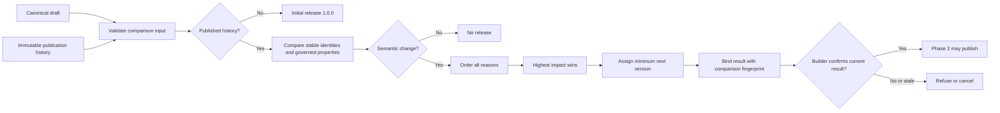

# Module and application version-impact policy

[Specification index](../README.md) · [Composition and publication](../03-composition-and-publication.md) · [Data contracts](data-contracts.md)

## Purpose

Vortex assigns the version of every module and application publication. A builder can confirm the assigned result or cancel publication, but cannot choose a lower or different version.

The comparison is pure and database-free. It compares one canonical draft with the latest immutable history supplied by the [Definition service](../../../runtime/definition), and it contains no knowledge of any installed application or business domain.

## Outcomes and versions

| Outcome | Meaning | Assigned version |
|---|---|---|
| `no_change` | Canonical content is semantically identical after only explicitly unordered collections are normalised. | None; another revision cannot be published. |
| `initial_release` | The definition has no published history. | Exactly `1.0.0`. |
| `release_required` | One or more governed semantic changes exist. | Minimum next patch, minor, or major stable version. |

Published definition versions are stable `major.minor.patch` values. Prerelease and build suffixes are not published definition history. Zero-valued segments are valid. Version arithmetic uses non-negative integers without an artificial machine-number limit.

| Impact | Example | Meaning |
|---|---|---|
| Patch | `1.2.3` → `1.2.4` | Text, presentation, geometry, or display order changes only. |
| Minor | `1.2.3` → `1.3.0` | A new compatible, optional capability or a proven widening. |
| Major | `1.2.3` → `2.0.0` | Removal, new requirement, narrowed input, identity/key/type replacement, changed executable behaviour, access/public/privacy/storage/ownership change, or anything whose compatibility cannot be proved from the two definitions. |

All material reasons are returned once. Reasons are sorted by severity, closed component-kind order, stable component identifier, closed property order, and reason code. The highest reason determines the release impact.

## Identity and ordering

Components are matched by permanent identifiers, never labels or array positions. A changed permanent identifier is a removal plus an addition and therefore major when the old component existed.

| Collection | Identity | Ordering rule |
|---|---|---|
| Module dependencies and application module bindings | `moduleRootId` | Unordered. |
| Record types, fields, relationships, permissions, actions, events, rules, extension points, saved sharing conditions | Their permanent identifiers | Unordered. |
| Action inputs | Key | Order is presentation-only patch. |
| Action effects | Parent action plus sequence | Order is executable behaviour; any change is major. |
| Navigation items | Item identifier | Sibling order is patch; target, parent, access, or type change is major. |
| Pages, roles, queries, blocks, pipelines, workflows, connections, interfaces, public addresses | Their permanent identifiers | Top-level collection order is irrelevant. |
| Page placements and guided steps | Placement or step identifier | Display order and pure geometry are patch. |
| Query fields, grouping, aggregates, and sort | Declared sequence | Existing query output/ordering change is major. |
| Workflow nodes and edges | Node identifier and edge tuple | Array order is irrelevant; graph or node behaviour change is major. |
| Pipeline stages | Stage key | Display order is patch; entry/exit work is executable order. |
| Choice options and table columns | Stored value or column key | Reordering is patch; identity/value/type removal is major. |

Duplicate comparison identities are refused as `ambiguous_component_identity`; the comparator never guesses which item is which. Cross-reference and full definition validity remain owned by [validation stages](../03-composition-and-publication.md#validation-before-publication) and [issue #15](https://github.com/Abzum-NZ/Abzum-Vortex/issues/15).

## Module policy

| Component or property | Patch | Minor | Major |
|---|---|---|---|
| Module | Name or description | — | — |
| Dependency | — | — | Add, remove, target/key change, or any version requirement change |
| Record type | Singular/plural labels | Add | Remove; key, storage lineage/scope, ownership, title field, or inherited-ownership link change |
| Standard/custom action membership | — | Add | Remove; membership order has no meaning |
| Relationship | — | Add | Remove or any existing relationship change |
| Permission | Label or description | Add | Remove; change key, record-type scope, action kind, named action, or administrative status |
| Action | Label and input display order | Add; add optional input; widen an input constraint | Remove; key/subject/permission/sharing/precondition/effect change; required input; remove/narrow/change input |
| Event | — | Add or add a carried field | Remove; key/record type/privacy choice or carried-field removal |
| Rule | — | — | Add, remove, priority, condition, trigger, or effect change |
| Extension point | — | Add or widen accepted kinds | Remove, retarget, rename key, or narrow accepted kinds |
| Saved sharing condition | Publication-test name/order only | Add | Remove or change record type, key, parameters, condition, declared fields, or test field/parameter values or expected result |

The saved sharing-condition collection is part of canonical module content. A sharing grant pins its condition identifier, revision, and fingerprint as specified in [record sharing](../16-copying-sharing-import-export.md#scope-and-saved-sharing-conditions). Revision and fingerprint are derived publication evidence, not independently authored changes, so the comparator ignores those two fields and classifies the underlying resolved contract change that caused them.

### Action inputs

An input label or input display-order change is patch. Adding an optional input, removing a validation pattern, increasing a maximum, decreasing a minimum, adding an allowed formatted-text block, or adding an allowed record type is minor. Adding a required input, removing an input, adding/changing a pattern, narrowing a bound, removing an allowed block/record type, or changing the input key/type is major. Date and date-time bounds follow chronological order. Organisation-account references have no hidden target setting.

### Common field properties

| Property | Patch | Minor | Major |
|---|---|---|---|
| Label/help text/search priority | Change | — | — |
| Required | — | `true` → `false` | `false` → `true` |
| Unique | — | `true` → `false` | `false` → `true` |
| Filterable/sortable | — | Enable | Disable |
| Default | — | — | Any semantic change |
| Personal-data/public-display classification | — | — | Any change |
| Field identifier, key, or type | — | — | Any change; cross-type compatibility is never inferred |

### Field settings

| Field type | Patch | Minor | Major |
|---|---|---|---|
| Text | — | Increase maximum length | Decrease maximum length or change format |
| Long text | — | Increase maximum length | Decrease maximum length |
| Formatted text | Allowed-block display order | Add allowed block; increase/remove maximum length | Remove block; decrease/add maximum length |
| Whole number | — | Lower/remove minimum; raise/remove maximum | Raise/add minimum; lower/add maximum; change step unless exact domain inclusion is proved |
| Decimal number | — | Lower/remove minimum; raise/remove maximum | Reverse bounds or change decimal precision/digit storage |
| Money | — | Widen numeric bounds | Narrow bounds or change currency mode/code |
| Yes/no | — | — | Common-property changes only |
| Date | — | Earlier/remove earliest; later/remove latest | Later/add earliest; earlier/add latest |
| Date and time | Display time zone | — | — |
| Choice | Option label/order | Add stored option | Remove or replace stored option value |
| Several choices | Option label/order | Add option; raise/remove selection maximum | Remove option; lower/add maximum |
| Reference number | — | — | Any setting change |
| Email address | — | — | Common-property changes only |
| Phone number | Default-country display/default hint | — | — |
| Web address | — | Proven allowed-scheme widening | Narrowing; omitted and HTTPS-only are equivalent in the first release |
| Table | Column order | Add optional column; lower minimum rows; raise maximum rows | Add required column; remove/change column; raise minimum; lower maximum |
| Link | — | — | Target, reverse key, or parent-delete change |
| Link to one of several | Target order | Add target | Remove target or change delete behaviour |
| Link to person | — | — | Any setting change unless a future contract proves a relaxation |
| Calculation | — | — | Result, expression, or dependency change |
| Total | — | — | Relationship, operation, field, filter, or currency change |
| Attachment | Kind/extension order | Add kind/extension; increase file-size or count limit | Remove kind/extension; decrease limit; change multiplicity |

## Application policy

| Component or property | Patch | Minor | Major |
|---|---|---|---|
| Application | Name, description, icon, theme, home page | — | — |
| Module or connection binding | — | — | Add, remove, or change; it changes a runtime dependency |
| Permission | Label or description | Add | Remove; change key, record-type scope, action kind, named action, or administrative status |
| Navigation | Label/order | Add optional item | Remove; change type, target, address, parent, or permission |
| Page | Name, pure layout/geometry/display order | Add non-public standalone page | Remove; add public/replacement page; change record/query/action/access/public/runtime behaviour |
| Role | Name | Add | Remove; change key, exact permissions or `*` expansion, or role home page |
| Query | — | Add unused optional query | Remove or change any existing query meaning or output order |
| Block registration | Name, icon, palette, pure phone geometry | Add | Remove or change version, settings, children, live/public/security behaviour |
| Pipeline | Stage label/display order | — | Add, remove, transition, target, gate, or entry/exit behaviour change |
| Action/event | Same module policy | Same module policy | Same module policy |
| Rule or workflow | Name only | — | Add, remove, graph, trigger, execution policy, value, or behaviour change |
| Interface | Description, declared interface version, supported → deprecated notice | Add private interface/operation; add optional target-compatible input; widen output/error/limits | Partner/public exposure; removal; method/path/required input/input or output target binding/auth/access/target/duplicate change; narrowing or any other state transition |
| Public address | — | — | Any add, removal, path, page, state, or rate-limit change |

Changing a placed block's tagged setting value or reference is major unless the owning block contract explicitly classifies that literal as presentation-only. Conditions, expressions, filters, and executable values are major when changed because the comparator cannot prove their effect safely.

## Workflow-node policy

The governed [24-node catalogue](../09-workflows-and-pipelines.md#first-release-node-catalogue) is generic. Adding a workflow or reachable node changes executable behaviour and is major. Removing, retyping, reconnecting, or changing any node is major. Node/edge array reorder alone is no change.

| Node | Major configuration |
|---|---|
| Start | Common execution properties or outgoing graph |
| Condition | Condition tree |
| Decision table | Ordered decisions, conditions, and outputs |
| Bounded loop | Query and maximum records |
| Delay | Duration |
| Wait until | Date/time field |
| Start workflow | Target workflow |
| Stop | Reason code |
| Create record | Record type and values |
| Change record | Record type, target record, and values |
| Run action | Action, subject, and inputs |
| Soft-delete record | Record type and target record |
| Duplicate record | Record type and source record |
| Add relationship | Relationship, subject, and target |
| Copy relationships | Relationship set and source/target records |
| Request form | Page, responder access, due time, timeout outcome, and outputs |
| Query records | Query |
| Set values | Target record and values |
| Format value | Formatter and input |
| Generate export | Query and maximum rows |
| Attach file | Record, field, and file |
| Move file | Record, field, and file |
| Call connection | Binding, operation, and inputs |
| Acknowledge message | Message key |

Every node's permission, timeout, retry, duplicate protection, activity key, and redaction policy is executable behaviour and therefore major when changed. Workflow-value source, literal, field, record, actor, time, or prior-node reference changes are also major.

## Integrity, history, and confirmation

The comparator refuses rather than classifies when:

- the request shape is invalid;
- history mixes definition kinds or root identifiers;
- revisions do not strictly increase;
- history does not begin at `1.0.0`, contains an unstable/reused/backwards version, or contains a content fingerprint that does not match its exact canonical content;
- the draft points at a different root, reports the wrong latest published revision, contains unresolved record-type references, or has duplicate comparison identities.

Exact content fingerprints use deterministic canonical JSON with sorted object keys and preserved array order. Comparison normalisation is separate: only the collections explicitly marked unordered above are reordered for semantic comparison.

The comparison fingerprint covers the policy version, definition kind and root, latest revision/version/fingerprint or an empty-history marker, exact candidate content fingerprint, outcome, ordered reasons, impact, and assigned version. Confirmation recomputes the assessment from the current request and accepts only the same subject, fingerprint, and assigned version. A stale result, override, or `no_change` confirmation is refused.

## Boundary with later work

Version impact does not prove installed dependant compatibility, resolve authored aliases, assess migrations, publish, restore, or query a database. [Validation ownership #15](https://github.com/Abzum-NZ/Abzum-Vortex/issues/15) owns full canonical/source validity, cross-definition resolution, dependency checks, and migration feasibility boundaries. Phase 2 owns persistence and atomic publication.
