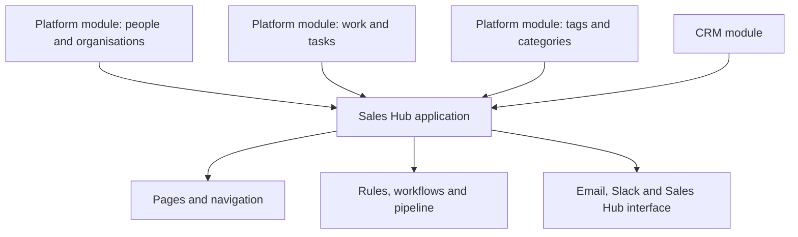
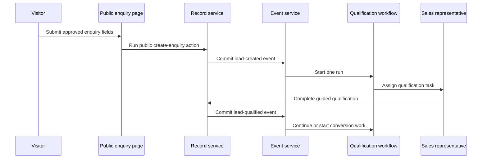

# Worked examples

[Specification index](../README.md) · [Data contracts](data-contracts.md) · [Coverage map](traceability.md)

The worked examples are executable acceptance fixtures, not informal illustrations. They must validate against the same contracts used for customer definitions.

## Required fixture set

The complete fixture set must contain:

1. CRM module.
2. People and organisations platform module.
3. Work and tasks platform module.
4. Tags and categories platform module.
5. Sales Hub application.
6. Qualification workflow contained by Sales Hub.
7. Deal-won workflow contained by Sales Hub.
8. Sales process pipeline contained by Sales Hub.
9. Email-sending connection type.
10. Slack connection type.
11. Sales Hub programmable interface.
12. Theme used by Sales Hub or an explicit platform-default theme reference.
13. Organisation and application roles referenced by the application.

The current [fixture README](../../../testing/fixtures/README.md), [CRM fixture](../../../testing/fixtures/vortex.crm.json), and [Sales Hub fixture](../../../testing/fixtures/app.sales_hub.json) remain source material, but they are not yet valid 2.0 fixtures. They omit the three platform modules and several referenced definitions, and their definition envelopes and fields predate this specification.

## CRM module

The CRM module contains:

- **Account:** a company, titled by company name, with reference number, industry, revenue, web address, phone, and totals.
- **Contact:** a person linked to one account, with personal-data classifications.
- **Lead:** an owned prospective enquiry that can be qualified or converted.
- **Deal:** an opportunity with account, owner, stage, amount, probability, expected close date, and controlled state changes.
- **Activity:** a dated business interaction linked to relevant CRM records.

Relationships are explicit. Required parent links use the deletion decision in [D07](decisions.md#d07-required-links-and-deletion). Money totals use [D08](decisions.md#d08-multi-currency-totals). Unique email and reference values use [D10](decisions.md#d10-uniqueness-and-restoration).

The module must declare every action and business event that the Sales Hub application references. At minimum this includes the lead-conversion and public-enquiry creation actions that are currently referenced but absent. A permission without an executable action is valid only when it protects a field option or ordinary record operation under an explicit contract.

## Sales Hub application

The Sales Hub application composes the four modules and includes:

- Executive dashboard.
- Deal pipeline board.
- Lead list and guided qualification form.
- Account and contact lists and details.
- Personal open-task view.
- Public sales-enquiry form.
- Application roles for sales representatives and sales managers.
- A sales pipeline with gated stage movement and escalation.
- Qualification and deal-won workflows.
- Optional assistant, public-form, and discount-approval capabilities.
- Email and Slack connection grants.
- A versioned Sales Hub programmable interface.

## Example working path

Every step uses [access and permissions](../04-access-and-permissions.md), [record saving](../06-records-and-lifecycle.md), [events](../08-forms-actions-rules-and-events.md), and [workflow callbacks](../09-workflows-and-pipelines.md). The public submission cannot set owner, stage, permissions, connection, workflow, or any field not explicitly listed by the public operation.

## Fixture acceptance

The complete fixture suite must prove:

- Every root, contained component, field, relationship, action, permission, role, option, page, block, query, event, workflow step, pipeline transition, connection operation, and interface operation resolves.
- Every field uses one of the twenty-two types and its exact allowed settings.
- Every public field has both field approval and operation allowlisting if [D04](decisions.md#d04-public-field-approval) option A is selected.
- Every visible screen has desktop and phone layouts and normal, empty, refused, validation, failure, and recovery states where applicable.
- Every referenced module and service definition is present; the validator never relaxes reference checks merely to accept a partial example.
- The fixtures use draft and published root envelopes chosen in [D02](decisions.md#d02-publication-boundaries).
- The fixture assertion count is generated from the current contract catalogue rather than maintained as a fixed marketing number.
