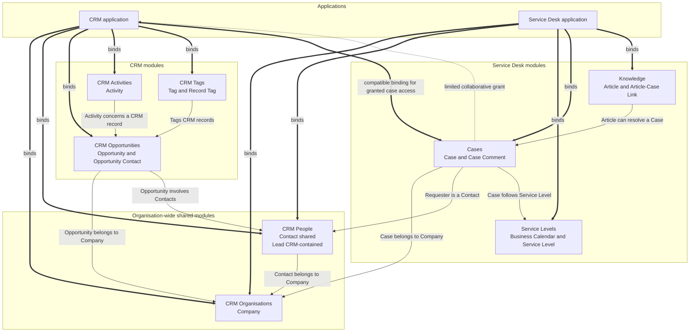
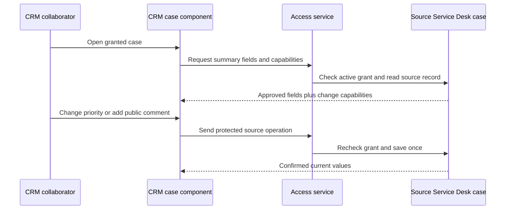
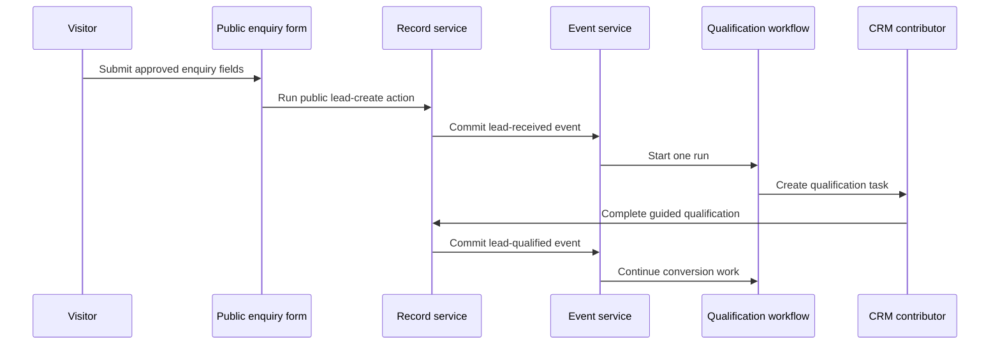
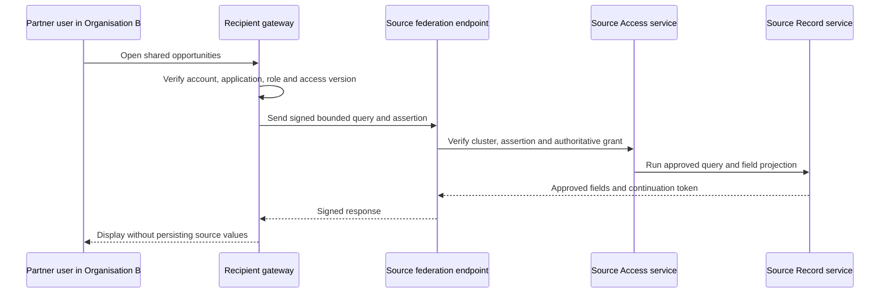

# Worked examples

[Specification index](../README.md) · [Data contracts](data-contracts.md) · [Coverage map](traceability.md) · [Fixture README](../../../testing/fixtures/README.md)

The worked examples are executable acceptance fixtures, not informal illustrations. They validate against the same contracts used for customer definitions and must contain no unresolved reference.

## Complete fixture set

The fixture set contains two independently versioned applications, eight independently versioned modules, their workflows and pipelines, and every connection type and interface operation they reference:

1. CRM Organisations module.
2. CRM People module.
3. CRM Opportunities module.
4. CRM Activities module.
5. CRM Tags module.
6. Service Desk Service Levels module.
7. Service Desk Cases module.
8. Service Desk Knowledge module.
9. CRM application.
10. Service Desk application.
11. Email, calendar, and webhook connection types.
12. Application-contained workflows, pipelines, roles, navigation, pages, themes, queries, actions, and interfaces.
13. Organisation scenarios for shared company/contact records and a limited collaborative case grant.

The complete set is written and validated before Phase 1 engine implementation. A partial example cannot pass by weakening reference checks.

## Application and module composition

Companies and contacts have `organisation_shared` storage. CRM and Service Desk bind the same module versions and use the same live records; neither application receives a copy.

Leads, opportunities, activities, cases, comments, and knowledge articles use `application_contained` storage. Another application needs a compatible module binding and an active inter-application grant before it can use such records.

## CRM application

CRM includes:

- Company, contact, and lead lists and details.
- Opportunity list, detail, board, calendar, and summary views.
- Activity list and calendar.
- Lead qualification and conversion workflow.
- Opportunity approval and won workflows.
- An opportunity pipeline with guarded stage changes.
- Application roles for CRM contributors and managers.
- Email and calendar connection bindings.
- A versioned CRM programmable interface.
- A shared-cases section that appears only when an active grant permits a case.

The application and every module have separate release versions. The published application records the exact module versions it resolved.

## Service Desk application

Service Desk includes:

- Case queue, board, detail, and calendar views.
- Customer company and requester views backed by the shared CRM modules.
- Service-level and business-calendar administration.
- Knowledge article list, detail, review, and public article pages.
- Case triage, assignment, escalation, and resolution workflows.
- A case lifecycle pipeline with guarded transitions and time targets.
- Application roles for agents, managers, and knowledge editors.
- Email and webhook connection bindings.
- A versioned Service Desk programmable interface.

## Same-record example

1. A CRM user creates Company `COM-0000001` and Contact `CON-0000001`.
2. An authorised Service Desk user opens the customer picker.
3. Service Desk reads those same records through its bindings to CRM Organisations and CRM People.
4. Service Desk creates a case linked to those source identifiers.
5. A permitted company-name change in either application is immediately visible in the other after the affected component refreshes.
6. No sharing grant, copied company row, copied contact row, or synchronisation workflow is created.

Each application still applies its own page and role permissions. Binding a shared module does not automatically let every application user read every record.

## Limited collaborative case example

A Service Desk case remains a source-owned `application_contained` record. CRM binds the compatible Service Desk Cases module so it can understand a granted record, but the binding alone grants no data access.

The fixture inter-application grant allows CRM to:

- Read `case_number`, `subject`, `status`, `priority`, `customer_company`, and `resolved_at`.
- Change `status` and `priority`.
- Run the published shareable action `vortex.service_desk.cases.case.add_public_comment`.

The grant does not expose the description, requester details, internal comments, attachments, service-level calculations, owner, deletion, restoration, export, permission administration, or re-sharing. The precise field and action list can differ for another approved use case.

Every allowed change uses the normal source save sequence, validation, activity history, and events. Service Desk users see the change on the same case. CRM does not own a second summary record.

When the grant is revoked, the next access check refuses the case. The CRM component removes already rendered values and shows that access ended. Browser history, client cache, subscriptions, search, and offline storage cannot preserve access. A completed approved export would be non-recallable, but this fixture grant does not allow export.

## Continuous interface example

The fixture applications demonstrate [core UI continuity and motion](../07-applications-pages-and-themes.md#core-ui-continuity-and-motion):

1. Moving between application pages keeps the application shell and navigation mounted.
2. The destination region shows immediate local loading feedback while its code or data arrives.
3. Refreshing a case list changes that list and its dependent count without replacing the company panel beside it.
4. Saving a priority change keeps unrelated selections, form input, focus, and scroll position.
5. Motion for React animates coordinated entry, exit, and layout changes; simple control feedback uses CSS transitions.
6. Reduced-motion mode presents the same states without spatial movement.
7. Revoked case data disappears without waiting for an exit animation.

## Workflow example

Every step uses [access and permissions](../04-access-and-permissions.md), [record saving](../06-records-and-lifecycle.md), [events](../08-forms-actions-rules-and-events.md), and [protected workflow operations](../09-workflows-and-pipelines.md#protected-operation-contract). The public submission cannot set owner, stage, permissions, connection, workflow, or any field not explicitly listed by the public operation.

## Cross-organisation and cross-cluster example

Organisation A grants a partner application in Organisation B access to opportunities selected by a version-pinned saved sharing condition. The proposal names one recipient application, approved roles, readable and changeable fields, published shareable actions, export choice, region, start, and expiry. Both organisations approve the same complete fingerprint before activation.

If the organisations are in one cluster, the shared-record gateway uses its local adapter. If they are in different clusters, it uses the signed [Vortex Federation API](../17-runtime-storage-and-caching.md#vortex-federation-between-clusters). The visible fields, allowed actions, activity meaning, revocation behaviour, and refusal codes are identical.

Revocation refuses the next source request even if recipient notification is delayed. Search, reports, and approved exports execute at the source. Recipient databases, files, indexes, materialised reports, workflow state, and cross-request caches receive no live source values.

## Tenant hierarchy and direct sharing example

A tenant may contain a parent organisation and several child organisations. A tenant administrator can manage hierarchy, combined usage, plans, and announcements without receiving record access. Reading a child organisation's CRM or Service Desk records still requires a local organisation account and local role.

Inside an organisation, an owner may directly share one record with an organisation account or team using readable and changeable field lists. Removing team membership ends that access on the next request.

## Fixture acceptance

The validator and later engine tests prove:

- Every file listed by the fixture manifest exists, and no definition file is unlisted.
- Every root, version, module dependency, record type, field, relationship, action, permission, role, option, page, block, query, event, workflow node, pipeline transition, connection operation, and interface operation resolves.
- Every field uses one of the twenty-two field types with its required settings.
- Every relationship names an existing compatible target and declared module dependency.
- Every workflow uses only registered safe nodes; arbitrary code, SQL, shell, network, and file access are absent.
- Every public field is approved by both its field definition and public operation.
- Both applications have independent versions and bind exact module versions.
- Shared company/contact tests prove one source record and separate application permissions.
- Limited case collaboration proves source ownership, field/action limits, immediate revocation, and no copied summary record.
- Every visible screen has desktop and phone layouts and applicable normal, empty, loading, validation, refused, conflict, failure, recovery, and reduced-motion states.
- The assertion count is generated from the current contract catalogue rather than maintained as a fixed marketing number.
