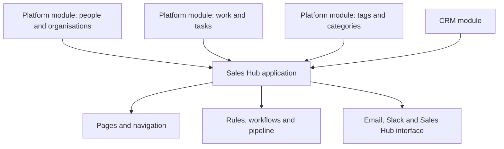
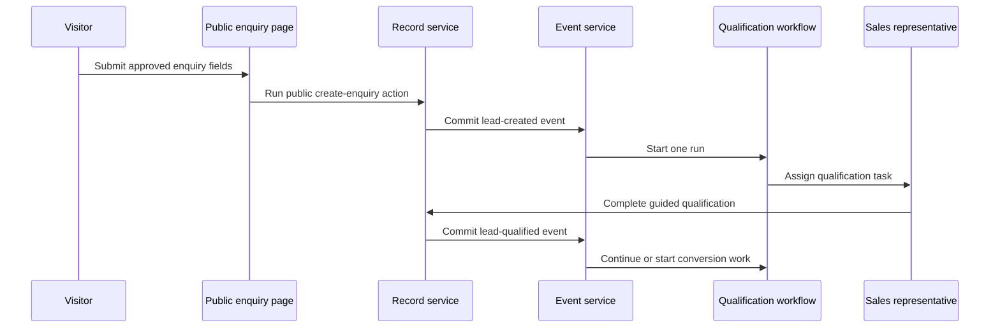
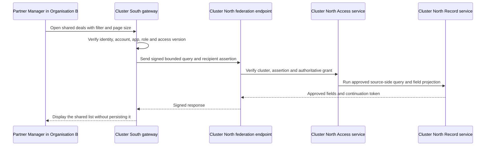
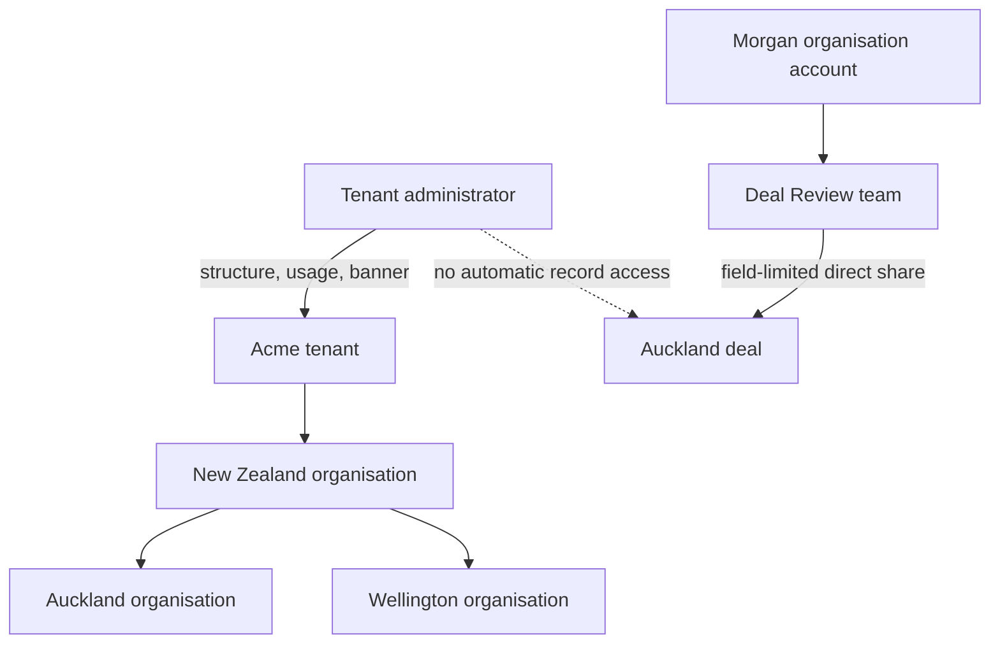

# Worked examples

[Specification index](../README.md) · [Data contracts](data-contracts.md) · [Coverage map](traceability.md)

The worked examples are executable acceptance fixtures, not informal illustrations. They must validate against the same contracts used for customer definitions.

## Required fixture set

The complete fixture set must contain:

1. CRM module.
2. People and organisations platform module.
3. Work and tasks platform module.
4. Tags and categories platform module.
5. Sales Hub application.
6. Qualification workflow contained by Sales Hub.
7. Deal-won workflow contained by Sales Hub.
8. Sales process pipeline contained by Sales Hub.
9. Email-sending connection type.
10. Slack connection type.
11. Sales Hub programmable interface.
12. Theme used by Sales Hub or an explicit platform-default theme reference.
13. Organisation and application roles referenced by the application.

The current [fixture README](../../../testing/fixtures/README.md), [CRM fixture](../../../testing/fixtures/vortex.crm.json), and [Sales Hub fixture](../../../testing/fixtures/app.sales_hub.json) remain source material, but they are not yet valid 2.0 fixtures. They omit the three platform modules and several referenced definitions, and their definition envelopes and fields predate this specification.

## CRM module

The CRM module contains:

- **Account:** a company, titled by company name, with reference number, industry, revenue, web address, phone, and totals.
- **Contact:** a person linked to one account, with personal-data classifications.
- **Lead:** an owned prospective enquiry that can be qualified or converted.
- **Deal:** an opportunity with account, owner, stage, amount, probability, expected close date, and controlled state changes.
- **Activity:** a dated business interaction linked to relevant CRM records.

Relationships are explicit. A required parent prevents deletion unless its relationship declares dependent-child soft-delete. Money totals refuse a group containing more than one currency. Soft-deleted unique email and reference values remain reserved until permanent removal.

The module must declare every action and business event that the Sales Hub application references. At minimum this includes the lead-conversion and public-enquiry creation actions that are currently referenced but absent. A permission without an executable action is valid only when it protects a field option or ordinary record operation under an explicit contract.

## Sales Hub application

The Sales Hub application composes the four modules and includes:

- Executive dashboard.
- Deal pipeline board.
- Lead list and guided qualification form.
- Account and contact lists and details.
- Personal open-task view.
- Public sales-enquiry form.
- Application roles for sales representatives and sales managers.
- A sales pipeline with gated stage movement and escalation.
- Qualification and deal-won workflows.
- Public-form and discount-approval capabilities.
- Email and Slack connection grants.
- A versioned Sales Hub programmable interface.

## Example working path

Every step uses [access and permissions](../04-access-and-permissions.md), [record saving](../06-records-and-lifecycle.md), [events](../08-forms-actions-rules-and-events.md), and [protected workflow operations](../09-workflows-and-pipelines.md#protected-operation-contract). The public submission cannot set owner, stage, permissions, connection, workflow, or any field not explicitly listed by the public operation.

## Fixture acceptance

The complete fixture suite must prove:

- Every root, contained component, field, relationship, action, permission, role, option, page, block, query, event, workflow step, pipeline transition, connection operation, and interface operation resolves.
- Every field uses one of the twenty-two types and its exact allowed settings.
- Every public field has both `public_display: allowed` and operation allowlisting.
- Every visible screen has desktop and phone layouts and normal, empty, refused, validation, failure, and recovery states where applicable.
- Every referenced module and service definition is present; the validator never relaxes reference checks merely to accept a partial example.
- The CRM module and Sales Hub application have separate release versions; the published application records the exact compatible module versions it resolved.
- The fixture assertion count is generated from the current contract catalogue rather than maintained as a fixed marketing number.

## Sharing examples

These examples extend the CRM and Sales Hub fixtures to demonstrate the approved local-and-cross-cluster [shared-record access](../04-access-and-permissions.md#shared-record-access) architecture and its final audience, approval, condition, action, field, export, re-sharing, search, report, and usage rules.

### Inter-application sharing

A Support Portal and Sales Hub both bind a compatible version of the CRM module. Because CRM accounts use `organisation_shared` storage, no sharing grant is needed: each application's roles still require their own account-read permission.

An Executive Review application also binds the Service Desk module. Draft response records use `application_contained` storage, so a narrow inter-application grant is required before Executive Review can read them.

That grant names:

- Source and recipient applications: Support Portal and Executive Review.
- Module and record type: Service Desk and `draft_response`.
- Scope kind: record type.
- Allowed action: read only.
- Readable fields: subject, safe response text, status, and owner.
- Export: refused by default.

The grant does not let Executive Review use any Service Desk record type, field, or action that is not named. It also does not create a second copy of a draft response.

### Cross-organisation sharing with filter

Organisation A operates a Sales Hub application. Organisation B is a partner. Organisation A shares deals that are tagged for partner collaboration.

An administrator in Organisation B copies its organisation sharing code from the Organisation Portal or sends a signed invitation link. Organisation A uses that exact code or link and confirms Organisation B's approved name and current region before proposing the grant. The lookup reveals no people, roles, applications, records, plan, or billing details.

The proposed grant:

- Source organisation: Organisation A.
- Recipient organisation: Organisation B.
- Recipient application and role: Partner Portal, Partner Manager.
- Module: `vortex.crm`.
- Record type: `deal`.
- Scope: published saved sharing condition `partner_deals`, with Organisation B as its declared partner parameter.
- Allowed actions: read, add a comment, and change `partner_status`.
- Readable fields: deal name, stage, close date, amount, and `partner_status`.
- Changeable field: `partner_status` only.
- Export: allowed for the named readable fields after both organisations review the non-recallable-download warning.
- Expiry: required by the approved sharing policy.

An authorised administrator in Organisation A approves this exact proposal. An authorised administrator in Organisation B separately accepts the Partner Portal, Partner Manager role, responsibility for an approved export, region, start, and expiry over the same fingerprint. The grant remains inactive until both decisions exist.

Organisation B's Partner Managers can use the ordinary deal list and detail components, search a Shared result group, run a report or dashboard block over Organisation A alone, add comments, update `partner_status`, and request the approved export. Each surface shows Organisation A as the source. They cannot see unnamed or sensitive fields, change the amount, re-share, use the data in a workflow, or access deals that no longer match. Search and reports run in Organisation A and leave no source values in Organisation B's index, report storage, or cross-request cache.

The `partner_deals` condition revision and Organisation B parameter are pinned in the proposal. Publishing another revision or changing the parameter does not widen the grant. A new proposal and both approvals are required.

### The same grant across two clusters

Organisation A is hosted in Cluster North and Organisation B is hosted in Cluster South. The grant above is unchanged; it additionally records the two cluster identifiers and compatible contract fingerprint.

If both organisations later move into one cluster, the gateway uses its local adapter and the visible result is the same. If Cluster North is unavailable, Organisation B sees “Source organisation temporarily unavailable” and no stored deal list. Revoking the source grant refuses the next request even if Cluster South has not yet received the revocation notice.

Each request creates linked usage entries: Organisation B receives the gateway-request usage, while Organisation A receives the source query, search, report, action, export/file, and any network-delivery usage. The same category is never counted on both entries.

When a Partner Manager requests the approved export, Cluster North generates a bounded temporary file from the current matching deals and approved fields. Cluster South stores no copy. Before download, the screen repeats that later revocation cannot recall the downloaded file and Organisation B accepts responsibility for its permitted storage, onward disclosure, retention, and deletion.

### Approval workflow for cross-organisation sharing

Before the cross-organisation grant above becomes active:

1. An administrator in Organisation A proposes the exact grant through the platform-owned `vortex.approvals` experience.
2. The protected request fingerprints its source, recipient, application, roles, saved condition revision and parameters, actions, fields, export choice, region, start, and expiry.
3. An authorised source approver records an immutable approval for that fingerprint.
4. Organisation B verifies the application binding, roles, destination, responsibility, and export warning; an authorised recipient approver accepts or refuses the unchanged fingerprint.
5. Organisation B's cluster returns the signed recipient decision.
6. Organisation A's Access service verifies both authorised decisions over the same fingerprint, activates the authoritative grant once, changes its local access version, and returns a signed activation receipt.
7. Organisation B stores the receipt in a non-content grant mirror and changes its local access version. A missed message is repaired by asking Organisation A for authoritative status.
8. Changing any fingerprinted value creates a new proposal and requires both decisions again.
9. A later authorised revocation ends the source grant and records a separate event; it does not rewrite either original decision. Delayed recipient notification cannot keep access alive.
10. Directly editing an approval display record never creates, activates, or revokes a grant.

## Tenant hierarchy and direct record sharing

Tenant Acme owns a parent organisation, New Zealand, with Auckland and Wellington child organisations. A tenant administrator can create Wellington, move it beneath New Zealand, view the tenant's combined usage, and publish a tenant-wide maintenance banner. That administrator cannot open Auckland's deals until Auckland creates a local organisation account and assigns the required Sales Hub role.

Inside Auckland, account Morgan belongs to both the Enterprise Sales and Deal Review teams. A deal owner directly shares one deal with Deal Review, allowing deal name, stage, and review note to be read and only review note to be changed. Morgan sees the deal in an ordinary list because of Deal Review membership. Morgan cannot change amount, delete, restore, export, or re-share it. Removing Morgan from Deal Review removes access on the next request even though Enterprise Sales membership remains.

